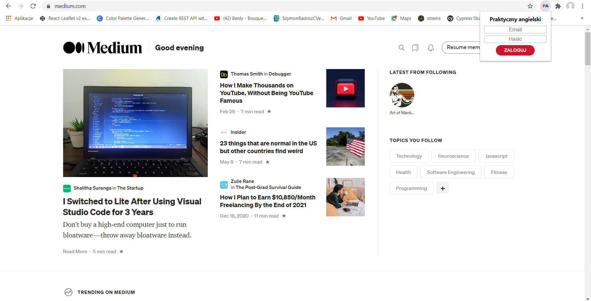
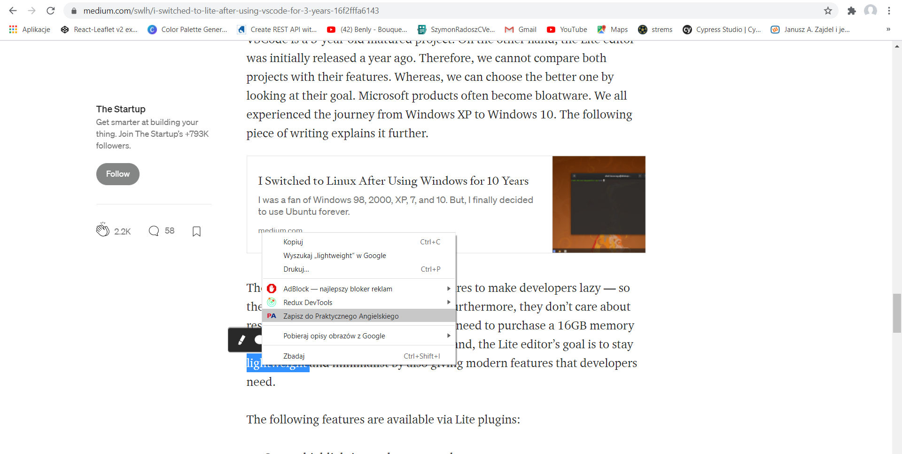
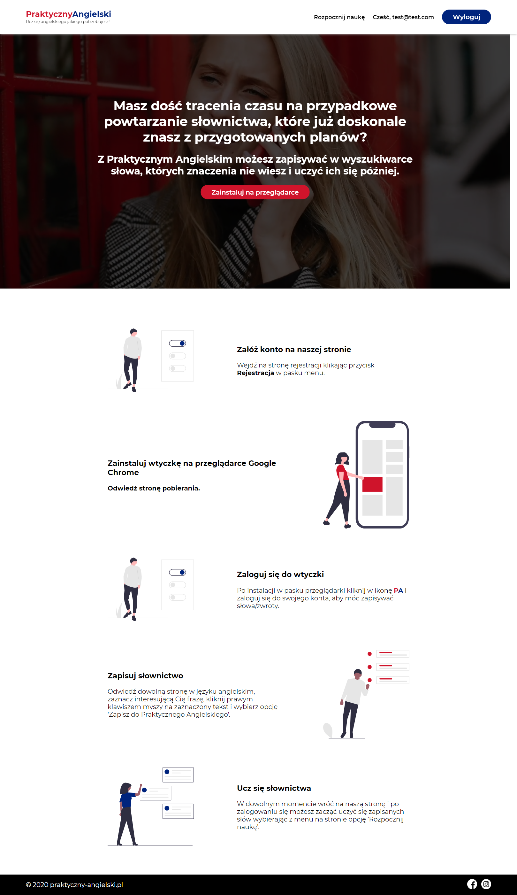
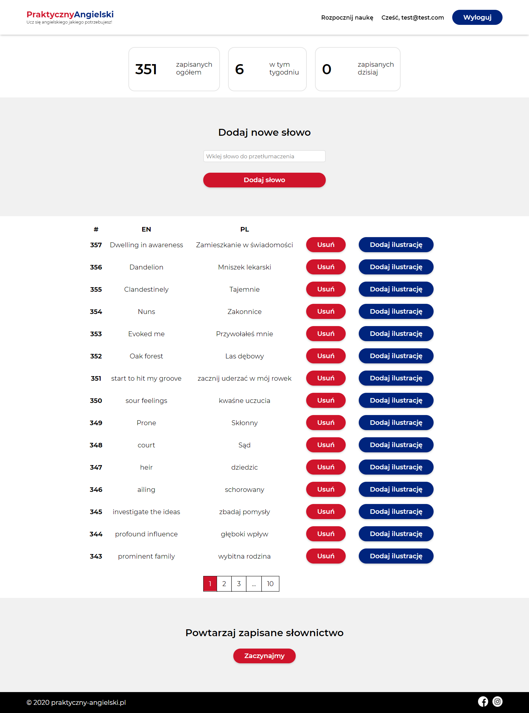
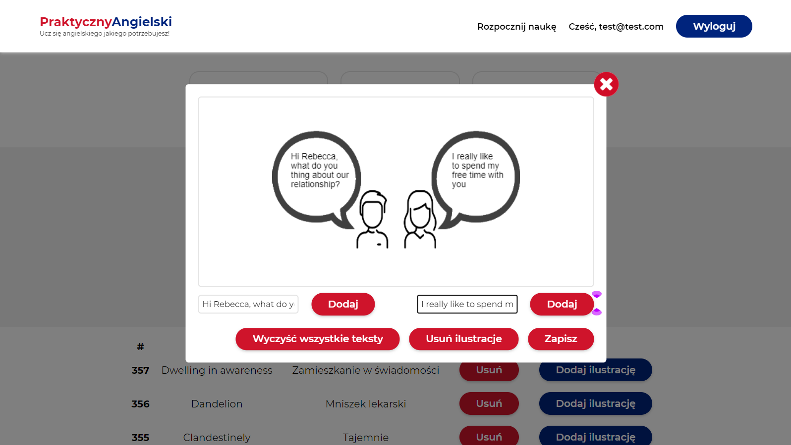
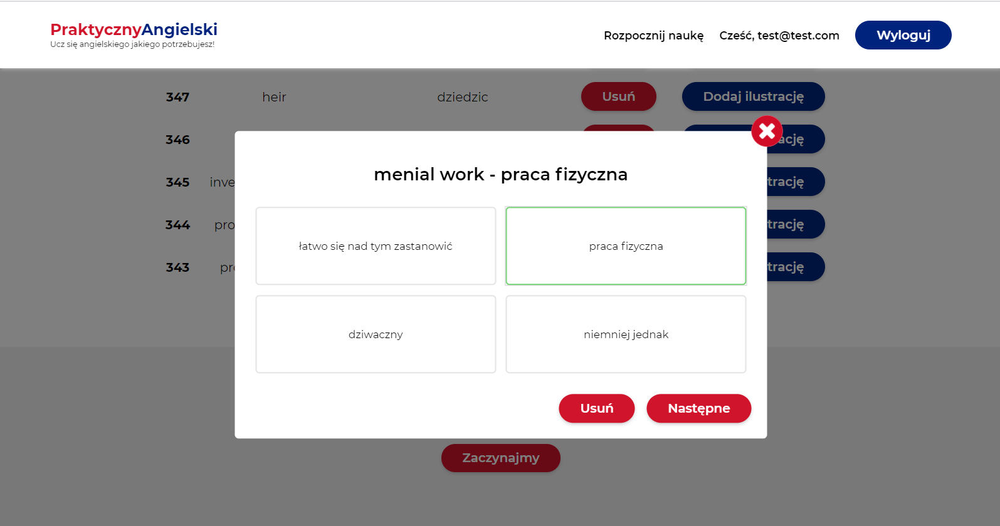
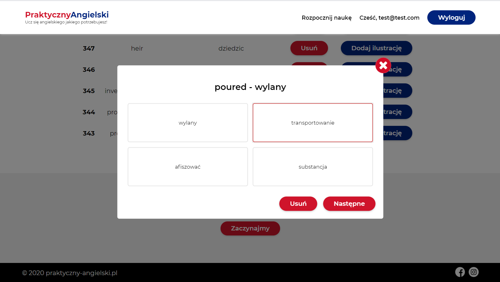

# Google Chrome plugin for translating English vocabulary with additional web application for learning the written words later.

## Preview

http://words.radoszszymon.usermd.net/

## Default .env

```
APP_NAME=Laravel
APP_ENV=local
APP_KEY=
APP_DEBUG=true
APP_URL=http://localhost

LOG_CHANNEL=stack

DB_CONNECTION=mysql
DB_HOST=127.0.0.1
DB_PORT=3306
DB_DATABASE=laravel
DB_USERNAME=root
DB_PASSWORD=

BROADCAST_DRIVER=log
CACHE_DRIVER=file
QUEUE_CONNECTION=sync
SESSION_DRIVER=file
SESSION_LIFETIME=120

REDIS_HOST=127.0.0.1
REDIS_PASSWORD=null
REDIS_PORT=6379

MAIL_MAILER=smtp
MAIL_HOST=smtp.mailtrap.io
MAIL_PORT=2525
MAIL_USERNAME=null
MAIL_PASSWORD=null
MAIL_ENCRYPTION=null
MAIL_FROM_ADDRESS=null
MAIL_FROM_NAME="${APP_NAME}"

AWS_ACCESS_KEY_ID=
AWS_SECRET_ACCESS_KEY=
AWS_DEFAULT_REGION=us-east-1
AWS_BUCKET=

PUSHER_APP_ID=
PUSHER_APP_KEY=
PUSHER_APP_SECRET=
PUSHER_APP_CLUSTER=mt1

MIX_PUSHER_APP_KEY="${PUSHER_APP_KEY}"
MIX_PUSHER_APP_CLUSTER="${PUSHER_APP_CLUSTER}"
```

## configure

```
composer install / shared hosting - COMPOSER_MEMORY_LIMIT=-1 composer install
npm i --legacy-peer-deps
php artisan jwt:secret
php artisan migrate
php artisan db:seed
```

## Deploy shared hosting

1. change MIX_APP_URL
2. npm run prod
3. push changes
4. pull on shared hosting
5. mv hostingDirectory/public/css/app.css public_html/css/
6. mv hostingDirectory/public/js/app.js public_html/js/

## Class not found

```
composer dump-autoload
```

## Laravel run test suites

```
./vendor/bin/phpunit
```

## Cypress tests

### headless
```
npx cypress run --headless
```

### with browser
```
npm run cypress
```

## Preview








